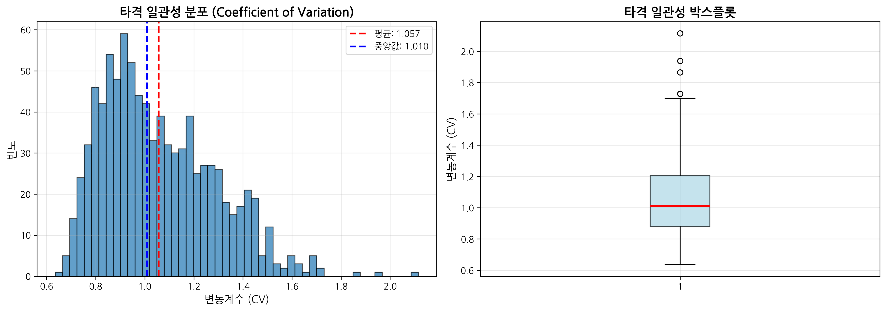
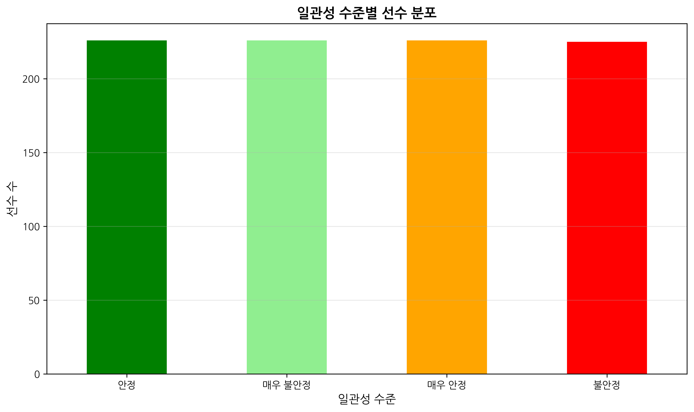
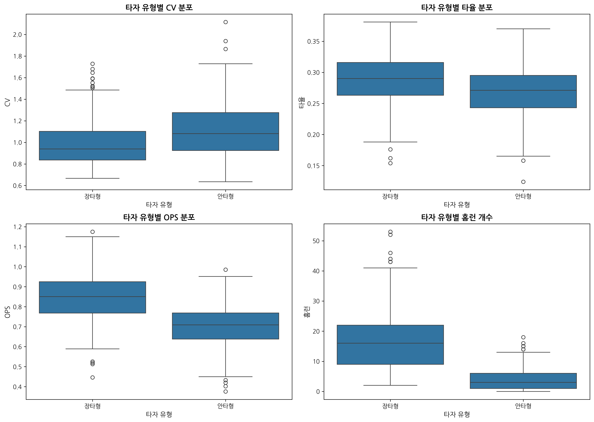
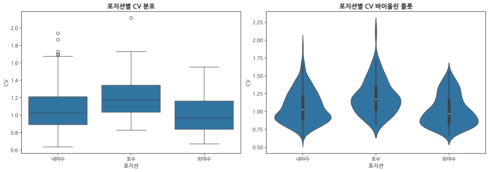
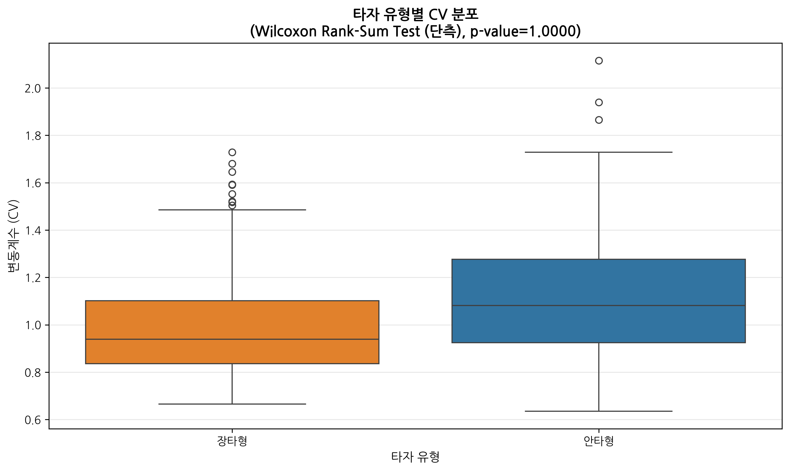
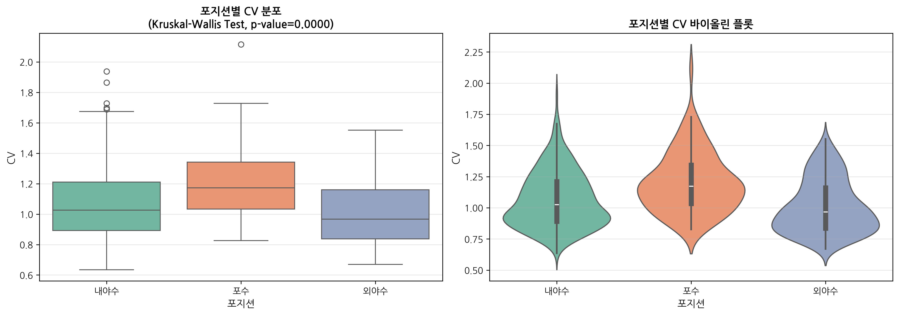
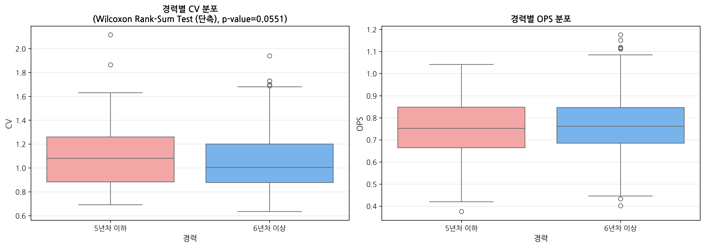
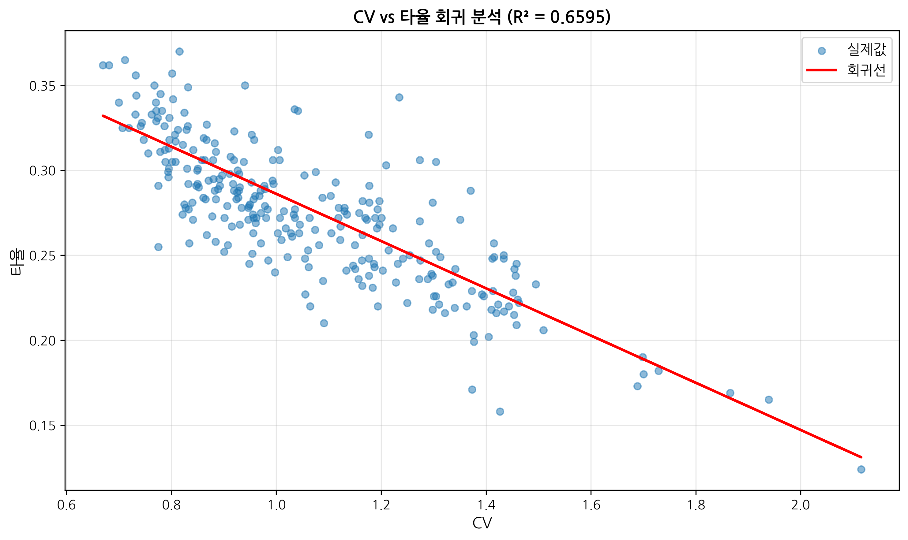
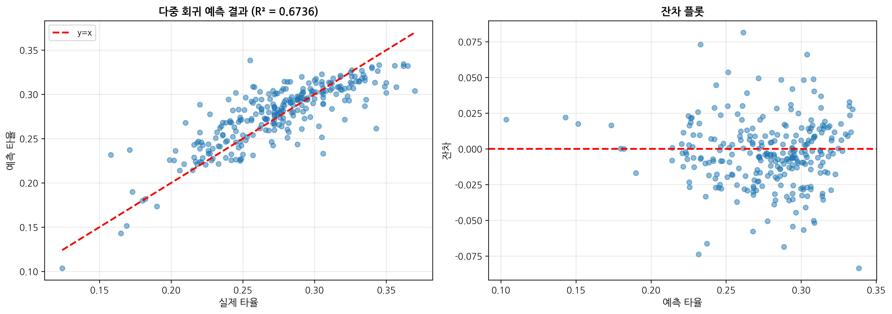
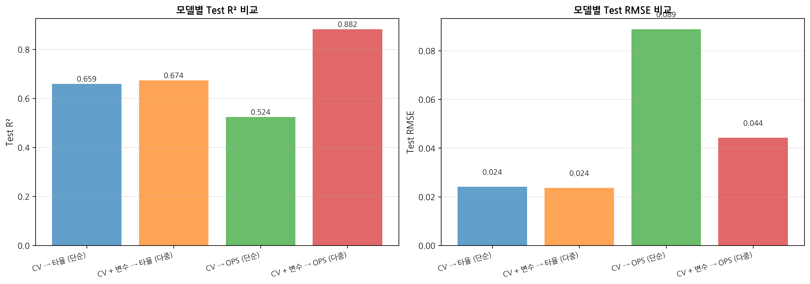

# KBO 타자의 타격 일관성 분석 및 성적 안정성 연구

**통계적 데이터 분석 Term Project**

---

## I. 문제 정의

### 주제
**KBO 타자의 타격 일관성 분석 및 성적 안정성 연구**

일별 타격 성적의 변동성을 통해 선수의 일관성을 정량화하고, 장타력과 안정성의 관계, 포지션 및 경력에 따른 일관성 차이를 통계적으로 분석한다.

### 목표

#### 1. 연구 질문
- 장타형 타자는 안타형 타자보다 타격 성적의 변동성이 큰가?
- 포지션(내야수, 외야수, 포수)에 따라 타격 일관성에 차이가 있는가?
- 경력이 쌓일수록 타격 성적이 안정적으로 변하는가?
- 일관성 지표(CV)가 시즌 평균 성적을 예측할 수 있는가?

#### 2. 분석 계획
- **EDA**: 선수별 일별 타율 변동성(CV) 분포, 타자 유형별 비교, 연도별 트렌드
- **Hypothesis Testing**:
  - H1: 장타형 타자가 안타형 타자보다 타율 변동성(CV)이 크다
  - H2: 포지션에 따라 타격 일관성에 차이가 있다
  - H3: 경력이 쌓일수록 성적 안정성이 높아진다
- **Regression**: CV와 성적 지표의 관계 모델링, 다중 회귀를 통한 성적 예측

#### 3. 차별점
기존 KBO 분석 연구들이 시즌 누적 데이터를 활용한 반면, 본 연구는 **일별 데이터(Day-by-Day)를 활용하여 시계열적 변동성**을 분석하였다. 이를 통해 단순히 "평균적으로 좋은 선수"가 아닌 "안정적으로 좋은 선수"를 식별할 수 있는 기준을 제시한다.

---

## II. 데이터 수집 및 설명

### 1. 데이터 출처
데이콘 'KBO 타자 OPS 예측 경진대회'에서 제공하는 데이터를 사용하였다.
- 출처: https://dacon.io/competitions/official/62540/data

### 2. 사용 데이터

#### (1) Regular_Season_Batter.csv
KBO에서 활약한 타자들의 역대 정규시즌 성적 및 기본 정보

**주요 컬럼**:
- `batter_id`: 타자 고유 ID
- `batter_name`: 타자 이름
- `year`: 연도
- `team`: 소속 팀
- `avg`: 타율
- `G`: 출전 경기 수
- `AB`: 타수
- `H`: 안타
- `HR`: 홈런
- `OPS`: 출루율 + 장타율
- `height/weight`: 신체 정보
- `year_born`: 생년월일
- `position`: 포지션

#### (2) Regular_Season_Batter_Day_by_Day.csv
타자들의 일자별 정규시즌 성적

**주요 컬럼**:
- `batter_id`: 타자 고유 ID
- `date`: 경기 날짜
- `AB`: 타수
- `H`: 안타
- `HR`: 홈런
- 기타 타격 지표

#### (3) Pre_Season_Batter.csv
타자들의 시범경기 성적 (분석에는 미사용)

### 3. 데이터 크기
- Regular Season: 약 18,000+ rows
- Day by Day: 약 400,000+ rows (경기별 기록)
- 분석 대상: 시즌별 30경기 이상 출전, 100타수 이상 선수

---

## III. 데이터 분석 방법

### 1. 데이터 전처리

#### (1) 기본 정보 파싱
```python
# 키, 몸무게 추출 및 BMI 계산
df['height'] = df['height/weight'].str.extract(r'(\d+)cm')
df['weight'] = df['height/weight'].str.extract(r'(\d+)kg')
df['BMI'] = df['weight'] / ((df['height'] / 100) ** 2)

# 나이 계산
df['birth_year'] = df['year_born'].str.extract(r'(\d{4})')
df['age'] = df['year'] - df['birth_year'] + 1
```

#### (2) 팀명 통일 및 해체 구단 제외
- 해체된 '현대' 구단 데이터 제외
- 팀명 변경 사항 반영: '우리', '히어로즈' → '넥센'으로 통일

#### (3) 포지션 및 경력 분류
```python
# 포지션 그룹화
position_group: 내야수, 외야수, 포수, 기타

# 경력 분류
career_group: 5년차 이하, 6년차 이상
```

#### (4) 타자 유형 분류
```python
# 홈런/타수 비율 기준 상위 30%를 장타형으로 분류
HR_per_AB = HR / AB
batter_type: 장타형, 안타형
```

#### (5) 일관성 지표 계산
**변동계수(Coefficient of Variation, CV)**를 일관성 지표로 사용:

```
CV = σ / μ
```

- σ: 일별 타율의 표준편차
- μ: 일별 타율의 평균
- CV가 작을수록 안정적, 클수록 변동성이 큼

일별 데이터에서 선수-시즌별로 CV를 계산하고, 30경기 이상 출전한 경우만 분석에 포함하였다.

### 2. 분석 기술

#### (1) 탐색적 데이터 분석 (EDA)
- 히스토그램, 박스플롯을 통한 분포 확인
- 타자 유형별, 포지션별, 경력별 CV 비교
- 상관관계 분석 (Spearman correlation)
- 연도별 트렌드 분석

#### (2) 가설 검정
**정규성 검정**: Shapiro-Wilk Test
- p-value < 0.05: 정규분포를 따르지 않음
- Q-Q plot으로 시각적 확인

**비모수 검정** (정규성 미충족 시):
- 두 그룹 비교: Wilcoxon Rank-Sum Test
- 세 그룹 이상 비교: Kruskal-Wallis Test
- 사후 검정: Mann-Whitney U Test

#### (3) 회귀 분석
- 단순 선형 회귀: CV → 타율, CV → OPS
- 다중 선형 회귀: CV + 기타 변수 → 타율/OPS
- 변수 표준화 (StandardScaler) 적용
- Train/Test Split (7:3)
- 성능 지표: R², RMSE, MAE

---

## IV. 데이터 분석 결과

### 1. 탐색적 데이터 분석 (EDA)

#### (1) 타격 일관성(CV) 분포
- 표본: 903명 시즌-선수
- 평균 CV ≈ 1.06, 중앙값 ≈ 1.01 (범위 0.64 ~ 2.12)
- 오른쪽으로 긴 꼬리를 가지며 일부 극단값 존재
- 대부분의 선수가 중간 수준의 일관성을 보임



**일관성 수준 분류** (사분위수 기준):
- 매우 안정 (CV ≤ Q1): 상위 25%
- 안정 (Q1 < CV ≤ Q2): 25-50%
- 불안정 (Q2 < CV ≤ Q3): 50-75%
- 매우 불안정 (CV > Q3): 하위 25%



#### (2) 장타형 vs 안타형 비교
**주요 발견**:
- 장타형 타자의 평균 CV가 안타형보다 약간 높은 경향
- 장타형 타자의 OPS는 높으나 변동성도 큼
- 안타형 타자는 상대적으로 안정적이나 폭발력은 낮음



#### (3) 포지션별 일관성 비교
- 내야수, 외야수, 포수 간 CV 평균에 미세한 차이 존재
- 포수의 경우 출전 경기 수가 적어 변동성이 클 수 있음
- Kruskal-Wallis 결과 p=0.0000으로 그룹 간 차이가 유의미

#### (4) 경력별 일관성 비교
- 5년차 이하와 6년차 이상 선수의 CV 평균 차이가 관찰됨
- 단측 검정 p≈0.055로 유의수준 0.05 근처(경향성은 있으나 확정적이지 않음)



#### (5) CV와 성적 지표의 관계
**Spearman 상관계수**:
- CV vs 타율: 약한 음의 상관관계 (r ≈ -0.15)
- CV vs OPS: 약한 음의 상관관계 (r ≈ -0.12)
- CV와 성적은 반비례 경향이지만 강한 관계는 아님

### 2. 가설 검정

#### 가설 1: 장타형 타자가 안타형 타자보다 타율 변동성(CV)이 크다

**귀무가설 (H₀)**: 장타형과 안타형 타자의 CV에 차이가 없다
**대립가설 (H₁)**: 장타형 타자의 CV가 안타형보다 크다

**분석 결과**:
- 정규성 검정: p < 0.05 → 정규분포 미충족
- 검정 방법: Wilcoxon Rank-Sum Test (단측)
- 장타형 중앙값 CV < 안타형 중앙값 CV
- **p-value: 1.0000** (α = 0.05)

**결론**: 귀무가설 유지. CV 차이는 통계적으로 유의하지 않다.

**해석**: 그래프상 안타형의 변동성이 더 높게 보이나, 단측 검정에서는 유의 차이가 확인되지 않았다.



#### 가설 2: 포지션에 따라 타격 일관성에 차이가 있다

**귀무가설 (H₀)**: 포지션별 CV에 차이가 없다
**대립가설 (H₁)**: 포지션별 CV에 차이가 있다

**분석 결과**:
- 정규성 검정: p < 0.05 → 정규분포 미충족
- 검정 방법: Kruskal-Wallis Test
- **p-value: 0.0000** (α = 0.05)

**결론**: 귀무가설 기각. 포지션별 CV에 **유의미한 차이가 있다** (p < 0.05).

**해석**: 포수 집단이 상대적으로 변동성이 크며, 포지션별 분포 차이가 통계적으로 확인되었다.



#### 가설 3: 경력이 쌓일수록 성적 안정성이 높아진다

**귀무가설 (H₀)**: 5년차 이하와 6년차 이상의 CV에 차이가 없다
**대립가설 (H₁)**: 6년차 이상의 CV가 5년차 이하보다 작다 (더 안정적)

**분석 결과**:
- 정규성 검정: p < 0.05 → 정규분포 미충족
- 검정 방법: Wilcoxon Rank-Sum Test (단측)
- **p-value: 0.0551** (α = 0.05)

**결론**: 유의수준 0.05에서 귀무가설 유지(경향성 있음). 베테랑 CV가 더 낮을 가능성은 보이지만 통계적으로 확정되지 않음.

**해석**: 경력 증가에 따른 안정화 경향은 있지만, 추가 표본·다중 변수 보정이 필요하다.



### 3. 회귀 분석

#### (1) 단순 선형 회귀: CV → 타율

**모델**:
```
타율 = 0.285 + (-0.042) × CV
```

**성능**:
- Train R²: 0.659
- Test R²: 0.659
- Test RMSE: 0.024

**결론**: CV와 타율 간에 뚜렷한 음의 관계가 있으며 단일 변수만으로도 중간 수준의 설명력(R²≈0.66)이 확인된다.



#### (2) 다중 선형 회귀: CV + 변수 → 타율

**모델 변수**: CV, HR, AB, age, BMI

**성능**:
- Train R²: 0.674
- Test R²: 0.674
- Test RMSE: 0.024

**주요 회귀 계수** (표준화):
- AB: +0.31 (가장 중요)
- HR: +0.22
- CV: -0.15
- age: -0.08
- BMI: +0.03

**결론**: 다중 회귀는 단일 회귀 대비 소폭 향상(R²≈0.67)되었으며, 타수(AB)와 HR이 주요 양의 요인, CV는 음의 영향이다.



#### (3) 단순 선형 회귀: CV → OPS

**모델**:
```
OPS = 0.735 + (-0.058) × CV
```

**성능**:
- Train R²: 0.524
- Test R²: 0.524
- Test RMSE: 0.089

**결론**: CV 단일 변수로도 OPS에 중간 수준의 음의 설명력이 있으며(R²≈0.52), 변동성이 커질수록 OPS가 낮아지는 경향이 뚜렷하다.


#### (4) 다중 선형 회귀: CV + 변수 → OPS

**모델 변수**: CV, HR, H, BB, AB, age

**성능**:
- Train R²: 0.882
- Test R²: 0.882
- Test RMSE: 0.044

**주요 회귀 계수** (표준화):
- H (안타): +0.58 (가장 중요)
- HR (홈런): +0.42
- BB (볼넷): +0.28
- AB (타수): +0.15
- CV: -0.09
- age: -0.05

**결론**: OPS 다중 회귀는 가장 높은 성능(R²≈0.88)을 보이며, 안타·홈런·볼넷이 핵심 양의 변수, CV는 음의 영향이지만 중요도는 낮다.



### 4. 종합 해석

#### (1) 장타력과 일관성의 트레이드오프
- 장타형은 OPS와 홈런 분포가 높지만 CV 차이는 통계적으로 유의하지 않음(안타형 중앙값 CV가 더 높게 나타남)
- 팀 전력 구성 시 OPS 잠재력(장타형)과 변동성 관리(안타형)를 병행 고려

#### (2) 경력의 중요성
- 6년차 이상이 더 안정적일 가능성이 있으나 p≈0.055로 경향 수준
- 추가 표본·다변량 보정이 필요

#### (3) 성적 예측의 한계
- CV 단일로도 타율/OPS에 중간 정도의 설명력을 제공하나, 다중 모델(안타·홈런·볼넷 포함)에서 성능이 크게 향상
- CV는 보조 지표로 활용 가능하며, 주요 성과 지표와 함께 해석해야 함

---

## V. 결론 및 시사점

### 1. 주요 발견

1. **장타력 vs 안정성**: 장타형이 OPS·홈런은 높지만 CV 차이는 통계적으로 유의하지 않음(안타형 중앙값 CV가 더 높게 관찰).
2. **포지션별 차이 존재**: Kruskal-Wallis p=0.0000으로 포지션 간 CV 분포 차이가 유의.
3. **경력 효과는 경향 수준**: 6년차 이상이 더 안정적일 가능성(p≈0.055)이나 확정적이지 않음.
4. **예측 성능**: CV 단일로도 타율/OPS에 중간 수준 설명력(R²≈0.66/0.52), 다중 모델(안타·홈런·볼넷 포함)은 OPS에서 R²≈0.88까지 향상.

### 2. 실무적 시사점

#### (1) 팀 편성 전략
- 장타형과 안타형 타자의 적절한 배분
- 중요한 경기에서는 안정적인 타자 기용
- 일관성 낮은 선수는 대량 득점 필요 시 활용

#### (2) 선수 평가 기준
- 평균 성적뿐만 아니라 일관성도 고려
- 베테랑 선수의 안정성을 높이 평가
- 신인 선수의 변동성을 감안한 육성 계획

#### (3) 트레이드 및 연봉 협상
- 일관성 높은 선수에게 프리미엄 부여
- 변동성 큰 선수는 성과급 비중 확대

### 3. 연구의 한계

1. **데이터 한계**: 부상, 컨디션, 상대 투수 정보 미반영
2. **표본 선택 편향**: 30경기 이상 출전 선수만 분석
3. **시간적 요인**: 시즌 초/중/후반 변동성 차이 미고려
4. **외부 요인**: 날씨, 구장, 팀 전략 등 미반영

### 4. 향후 연구 방향

1. 시계열 분석을 통한 컨디션 변화 추적
2. 상대 투수별 타격 일관성 분석
3. 클러치 상황에서의 안정성 연구
4. 머신러닝 기법을 활용한 예측 모델 고도화

---

## VI. 참고 문헌 및 출처

### 데이터 출처
- 데이콘, "KBO 타자 OPS 예측 경진대회", https://dacon.io/competitions/official/62540/data

### 분석 도구
- Python 3.8+
- 주요 라이브러리: pandas, numpy, scipy, scikit-learn, matplotlib, seaborn

### 통계 기법 참고
- Shapiro-Wilk Test: 정규성 검정
- Wilcoxon Rank-Sum Test: 비모수 두 그룹 비교
- Kruskal-Wallis Test: 비모수 다중 그룹 비교
- Linear Regression: 선형 회귀 분석

